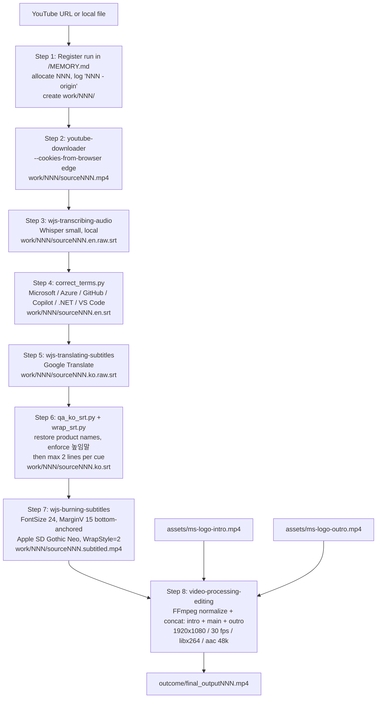

# youtube-video-clip-editing

Copilot CLI skill: turn a YouTube URL into a Korean-subtitled clip bracketed by a Microsoft Azure intro/outro bumper — end-to-end, one prompt.

> ⚠️ **Before you run: sign into YouTube in Microsoft Edge.**
> The pipeline reuses your Microsoft Edge browser cookies (`yt-dlp --cookies-from-browser edge`) to fetch adaptive **HD 1080p** formats and bypass DRM-flagged responses on other YouTube clients. If you are not signed into YouTube in Edge, downloads may return HTTP 403 or fall back to the 360p muxed format (`-f 18`) — which will make the final clip look low-resolution.
>
> **Fix:** open Microsoft Edge, go to `https://www.youtube.com/`, and sign in with your Google account **once**. Copilot CLI + `yt-dlp` will reuse that Edge cookie cache automatically for every subsequent run. No API key is required.
>
> Prefer a different signed-in browser? Set `COOKIE_BROWSER=brave|chrome|chromium|firefox|opera|safari|vivaldi|whale` when invoking the script.

## What it does

This repository helps localize and brand a source video clip into a shareable deliverable: it starts from a YouTube URL or local `.mp4`, transcribes English audio, corrects Microsoft/Azure/GitHub product-name spellings, translates to Korean, QAs that translation (restoring product names mistranslated as common nouns and normalizing the speech level to 높임말) while hard-capping every cue to at most 2 subtitle lines, burns the Korean subs in at FontSize 24, and wraps the result with Microsoft Azure intro/outro bumper clips.

It is a thin orchestrator. The skill defined in `.github/skills/youtube-video-clip-editing/` sequences four sibling Copilot CLI skills (`youtube-downloader`, `wjs-transcribing-audio`, `wjs-translating-subtitles`, `wjs-burning-subtitles`) plus a product-name review, a Korean translation QA pass, a subtitle-wrap pass, and an FFmpeg concat step; the repo mostly codifies the order, filenames, and handoffs.

## How to use it with the GitHub Copilot CLI

### Natural-language prompt

Start the Copilot CLI and describe the complete request at the `copilot` REPL:

```text
copilot
> Download https://www.youtube.com/watch?v=VIDEO_ID, transcribe and
  translate it to Korean, burn in the Korean subtitles, and bracket
  it with our Microsoft logo intro/outro from assets/ms-logo-intro.mp4
  and assets/ms-logo-outro.mp4.
```

### Direct shell invocation

You can also run the bundled orchestrator script directly:

```bash
.github/skills/youtube-video-clip-editing/scripts/produce_localized_clip.sh \
  "https://www.youtube.com/watch?v=VIDEO_ID" \
  assets/ms-logo-intro.mp4 \
  assets/ms-logo-outro.mp4
```

The script registers the run in `MEMORY.md`, allocates the next `NNN`, creates a per-run scratch folder at `work/NNN/`, and writes the deliverable to `outcome/final_outputNNN.mp4`.

## Flow



## Where to find the outputs

| Item | Location |
| --- | --- |
| **Deliverable** | `./outcome/final_outputNNN.mp4` at repo root (`NNN` is the run id). |
| **Run registry** | `./MEMORY.md` — one line per run in `NNN - <origin>` form. |
| **Intermediates (per run)** | `./work/NNN/sourceNNN.mp4`, `sourceNNN.en.raw.srt`, `sourceNNN.en.srt`, `sourceNNN.ko.raw.srt`, `sourceNNN.ko.srt`, `sourceNNN.subtitled.mp4`, `norm_NNN_{intro,main,outro}.mp4`, `concat_NNN.txt`. |
| **Assets (inputs to Step 8)** | `./assets/ms-logo-intro.mp4`, `./assets/ms-logo-outro.mp4`. |

Each run gets its own `work/NNN/` folder. When you're done with a run and have the deliverable, you can free space with `rm -rf work/NNN`.

## Subtitle rules (hard-coded)

- **Default font size: 24.** Overrideable via `SUB_FONT_SIZE` but 24 is chosen deliberately.
- **Bottom-anchored placement: `MarginV=15`.** Subtitles sit close to the bottom of the frame so the eye stays on the main image. Overrideable via `SUB_MARGIN_V`.
- **Every cue is 2 lines maximum.** `scripts/wrap_srt.py` measures display width (CJK chars count as 2 units), targets ≤ 46 units per line, and either wraps to 2 lines or splits the cue in time.
- **Product names are auto-corrected before translation.** `scripts/correct_terms.py` normalizes `Microsoft`, `Azure`, `GitHub`, `Copilot`, `Microsoft Azure`, `Azure OpenAI`, `GitHub Copilot`, `.NET`, `VS Code`, `Power BI`, `Microsoft 365`, `SQL Server`, `Windows`, `PowerShell`, `OpenAI`, `ChatGPT`, `TypeScript`, `JavaScript`, `Kubernetes`, `Docker`, `Linux`, `macOS`, and more, using case-insensitive matching and correctly-cased replacement.
- **The Korean translation is QA'd before it is burned in.** See below.

Add a new product name by appending it to the `CORRECTIONS` list in `scripts/correct_terms.py` (longer phrases before shorter ones) **and** to `PRODUCTS` in `scripts/qa_ko_srt.py`.

## Korean translation QA (Step 6)

Machine translation gets two things reliably wrong on Microsoft content, so `scripts/qa_ko_srt.py` runs between translation and burn-in to fix them.

### 1. Product names translated as ordinary nouns

Google Translate happily turns product names into common nouns. Real examples pulled from this repo's own runs:

| English | Machine translation | After QA |
|---|---|---|
| Fabric | 직물 (textile) | **Fabric** |
| Copilot | 부조종사 (co-pilot, aviation) | **Copilot** |
| Azure Friday | 푸른 금요일 (blue Friday) | **Azure Friday** |
| Playwright | 극작가 (dramatist) | **Playwright** |
| Sentinel | 보초 (sentry) | **Sentinel** |
| Foundry | 파운드리 | **Foundry** |

Restoration is **context-gated and case-sensitive**: a Korean word is only rewritten when the aligned English cue contains that product name capitalized. So "the **fabric** of the chair" keeps 직물, while "a **Fabric** workspace" becomes Fabric. This works because Step 4 has already normalized English casing.

> **Steps 4 and 6 are coupled.** If a product name is missing from `correct_terms.py`, the English SRT keeps Whisper's lowercase spelling, the gate declines, and the mistranslation ships. This actually happened with `playwright` → 극작가. When a bad translation survives QA, check the English SRT casing before blaming the Korean lexicon — and add new terms to **both** scripts.

Swapping a Korean noun for an English one also breaks Korean particle agreement, which the script repairs — 부조종사**를** becomes Copilot**을** (closed syllable) while 푸른**은** becomes Azure**는** (open syllable).

### 2. Inconsistent speech level (높임말)

Raw output mixes 합쇼체 (`~습니다`), 해요체 (`~해요`) and 한다체/반말 (`~한다`) — sometimes inside one sentence. Subtitles should be uniformly polite, so everything is conjugated to 합쇼체:

| Before | After |
|---|---|
| 그럼 우리는 간다. | 그럼 우리는 **갑니다**. |
| 큰 실수를 저질렀다. | 큰 실수를 **저질렀습니다**. |
| 꽤 멋지다. | 꽤 **멋집니다**. |
| 다양한 전략이 있어요 | 다양한 전략이 **있습니다** |

This uses Hangul jamo arithmetic rather than a word list, so verbs the author never anticipated are still conjugated correctly. Endings that are *already* polite — `입니다`, `습니다`, the propositive `~ㅂ시다` (봅시다), the interrogative `~ㄴ가요?` — are detected and left alone.

### The QA report

Anything the script will not fix confidently is written to `work/NNN/sourceNNN.ko.qa-report.txt` instead of being guessed at. It lists every automatic rewrite with its English source, any cue still in plain form, and any cue where the English mentioned a product that never appeared in the Korean. Read it after a run and hand-fix the short list.

Validate the rules themselves at any time — this is the one piece of the repo with real tests:

```bash
.venv/bin/python .github/skills/youtube-video-clip-editing/scripts/qa_ko_srt.py --self-test
```

You can also run QA standalone against an existing run:

```bash
.venv/bin/python .github/skills/youtube-video-clip-editing/scripts/qa_ko_srt.py \
  work/003/source003.en.srt work/003/source003.ko.raw.srt \
  work/003/source003.ko.qa.srt --report work/003/source003.ko.qa-report.txt
```

## Prereqs and useful info

### Prerequisites

- **Sign into YouTube in Microsoft Edge before running the pipeline.** The `yt-dlp` step uses your Edge browser cookies (`--cookies-from-browser edge`) to fetch adaptive HD formats and to bypass DRM-flagged responses on other clients. If you're not signed in, downloads may return 403 or fall back to low-resolution (360p) muxed formats. If you use a different browser, sign in there and swap `edge` for `brave`, `chrome`, `chromium`, `firefox`, `opera`, `safari`, `vivaldi`, or `whale` in the command below.
- macOS with Homebrew.
- `ffmpeg` from the `homebrew-ffmpeg/ffmpeg` tap. The regular `homebrew/core` ffmpeg lacks libass and the `subtitles` filter needed for subtitle burning.
- `yt-dlp`.
- Python 3 with a project-local venv (`.venv/`) holding `openai-whisper` and `deep-translator`. The orchestrator preflights `.venv/bin/whisper` and exits with an actionable message if it is missing.

```bash
brew install yt-dlp
brew uninstall ffmpeg 2>/dev/null || true
brew tap homebrew-ffmpeg/ffmpeg
brew install homebrew-ffmpeg/ffmpeg/ffmpeg
python3 -m venv .venv
.venv/bin/pip install openai-whisper deep-translator
```

### YouTube HD download command

Use browser cookies and alternate YouTube clients by default so adaptive HD formats are available. The default is `edge`; swap for any browser `yt-dlp` supports (`brave`, `chrome`, `chromium`, `firefox`, `opera`, `safari`, `vivaldi`, `whale`) — pick the one where you're actually signed into YouTube.

```bash
yt-dlp --cookies-from-browser edge \
  --extractor-args "youtube:player_client=web,mweb" \
  -f "bv*[height<=1080]+ba/b[height<=1080]" \
  --merge-output-format mp4 \
  -o "work/NNN/sourceNNN.mp4" "<youtube_url>"
```

`-f 18` (360p muxed mp4) is a fallback only when adaptive HD formats are unavailable.

### One-bumper fallback

If you only have one branding clip, omit the outro argument; the orchestrator reuses the intro clip as the outro.

### Local file source

You can pass a local `.mp4` path in place of a YouTube URL. The orchestrator logs that path as `<origin>` in `/MEMORY.md`.

### Trimming a source (using only part of a video)

The orchestrator has no trim option. To localize only a section, download that section first and feed the resulting file in as a local source:

```bash
yt-dlp --cookies-from-browser edge \
  --extractor-args "youtube:player_client=web,mweb" \
  -f "bv*[height<=1080]+ba/b[height<=1080]" \
  --merge-output-format mp4 \
  --download-sections "*00:01:30-00:59:51" \
  --force-keyframes-at-cuts \
  -o "/tmp/trim/src.mp4" "<youtube_url>"

.github/skills/youtube-video-clip-editing/scripts/produce_localized_clip.sh \
  /tmp/trim/src.mp4 assets/ms-logo-intro.mp4 assets/ms-logo-outro.mp4
```

`--force-keyframes-at-cuts` makes the section boundaries frame-accurate. Afterwards, rewrite that run's `MEMORY.md` line so the origin points at the YouTube URL plus the range, e.g. `004 - <youtube_url> [trim 00:01:30-00:59:51]` — otherwise provenance is lost when the temp file is deleted.

### Large deliverables and Git LFS

Finished clips can be large (a ~1 hour 1080p run is ~300 MB). GitHub **rejects** any single file over 100 MB, so `outcome/*.mp4` is tracked with [Git LFS](https://git-lfs.github.com):

```bash
brew install git-lfs
git lfs install
git lfs track "outcome/*.mp4"   # already recorded in .gitattributes
```

Clone the repo with `git lfs pull` to fetch the actual videos. Note the free GitHub LFS tier is 1 GB of storage and 1 GB/month of bandwidth — if you accumulate many long runs you may need to buy a data pack or stop versioning `outcome/`.

**Retention policy:** to stay inside that quota, deliverables larger than 100 MB are not kept in the repo. When a run exceeds it, drop the deliverable and the bulky `work/NNN/` intermediates, then annotate the run in `MEMORY.md`:

```bash
git rm --cached outcome/final_outputNNN.mp4
rm -f outcome/final_outputNNN.mp4
rm -f work/NNN/sourceNNN.mp4 work/NNN/sourceNNN.subtitled.mp4 work/NNN/norm_NNN_main.mp4
```

Keep the `.srt` files — they hold the expensive Whisper transcription and translation output, so regenerating the clip only needs a re-download plus a re-burn, not a full re-transcribe. Mark the run as `NNN - <origin> [outcome removed: >100MB]` so it is clear the deliverable is reproducible rather than missing by accident.

### Orchestrator configuration

The script accepts `AUTO_INSTALL_DEPS`, `COOKIE_BROWSER` (default `edge`), `WHISPER_MODEL` (default `small`), `SOURCE_LANG`/`TARGET_LANG` (defaults `en`/`ko`), `SUB_FONT`, `SUB_FONT_SIZE` (default **`24`**), `SUB_MARGIN_V` (default **`15`**), and `MEMORY_FILE`.

### Authoritative spec

See `.github/copilot-instructions.md` for the authoritative conventions, pipeline invariants, and gotchas.
