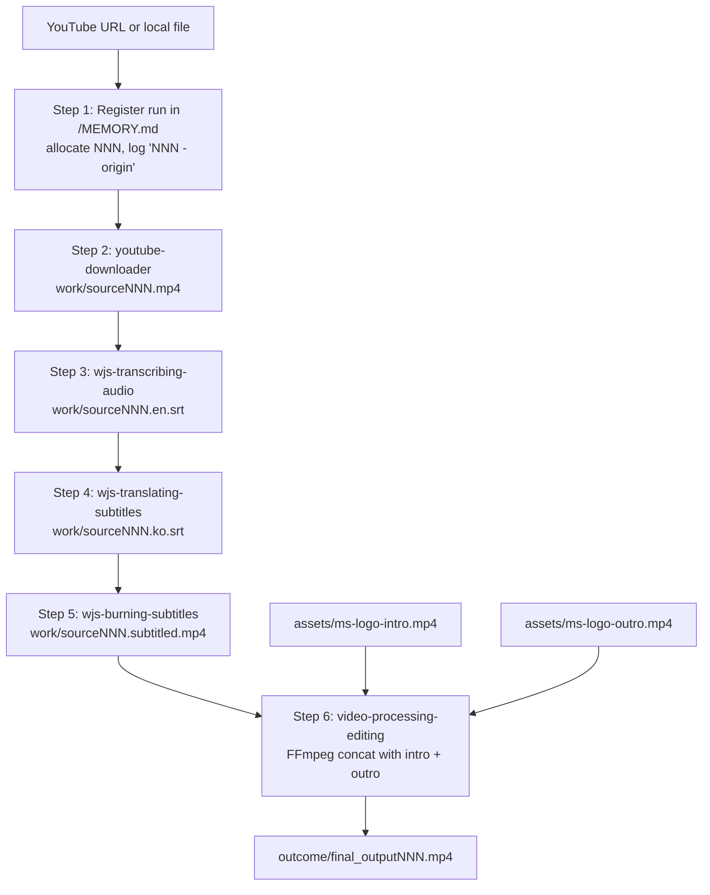

# youtube-video-clip-editing

Copilot CLI skill: turn a YouTube URL into a Korean-subtitled clip bracketed by a Microsoft Azure intro/outro bumper — end-to-end, one prompt.

## What it does

This repository helps localize and brand a source video clip into a shareable deliverable: it starts from a YouTube URL or local `.mp4`, produces English and Korean subtitles, burns in the Korean subtitles, and wraps the result with Microsoft Azure intro/outro bumper clips.

It is a thin orchestrator. The skill defined in `.github/skills/youtube-video-clip-editing/` sequences four sibling Copilot CLI skills (`youtube-downloader`, `wjs-transcribing-audio`, `wjs-translating-subtitles`, `wjs-burning-subtitles`) plus an FFmpeg concat step; the repo mostly codifies the order, filenames, and handoffs.

## How to use it with the GitHub Copilot CLI

### Natural-language prompt

Start the Copilot CLI and describe the complete request at the `copilot` REPL:

```text
copilot
> Download https://www.youtube.com/watch?v=VIDEO_ID, transcribe and
  translate it to Korean, burn in the Korean subtitles, and bracket
  it with our Microsoft logo intro/outro from assets/ms-logo-intro.mp4
  and assets/ms-logo-outro.mp4.
```

### Direct shell invocation

You can also run the bundled orchestrator script directly:

```bash
.github/skills/youtube-video-clip-editing/scripts/produce_localized_clip.sh \
  "https://www.youtube.com/watch?v=VIDEO_ID" \
  assets/ms-logo-intro.mp4 \
  assets/ms-logo-outro.mp4
```

The script registers the run in `MEMORY.md`, allocates the next `NNN`, and writes the deliverable to `outcome/final_outputNNN.mp4`.

## Flow



## Where to find the outputs

| Item | Location |
| --- | --- |
| **Deliverable** | `./outcome/final_outputNNN.mp4` at repo root (`NNN` is the run id). |
| **Run registry** | `./MEMORY.md` — one line per run in `NNN - <origin>` form. |
| **Intermediates (per run)** | `./work/sourceNNN.mp4`, `sourceNNN.en.srt`, `sourceNNN.ko.srt`, `sourceNNN.subtitled.mp4`, `norm_NNN_{intro,main,outro}.mp4`, `concat_NNN.txt`. |
| **Assets (inputs to Step 6)** | `./assets/ms-logo-intro.mp4`, `./assets/ms-logo-outro.mp4`. |

## Prereqs and useful info

### Prerequisites

- **Sign into YouTube in Microsoft Edge before running the pipeline.** The `yt-dlp` step uses your Edge browser cookies (`--cookies-from-browser edge`) to fetch adaptive HD formats and to bypass DRM-flagged responses on other clients. If you're not signed in, downloads may return 403 or fall back to low-resolution (360p) muxed formats. If you use a different browser, sign in there and swap `edge` for `brave`, `chrome`, `chromium`, `firefox`, `opera`, `safari`, `vivaldi`, or `whale` in the command below.
- macOS with Homebrew.
- `ffmpeg` from the `homebrew-ffmpeg/ffmpeg` tap. The regular `homebrew/core` ffmpeg lacks libass and the `subtitles` filter needed for subtitle burning.
- `yt-dlp`.
- Python 3 with a project-local venv (`.venv/`) holding `openai-whisper` and `deep-translator`. The orchestrator preflights `.venv/bin/whisper` and exits with an actionable message if it is missing.

```bash
brew install yt-dlp
brew uninstall ffmpeg 2>/dev/null || true
brew tap homebrew-ffmpeg/ffmpeg
brew install homebrew-ffmpeg/ffmpeg/ffmpeg
python3 -m venv .venv
.venv/bin/pip install openai-whisper deep-translator
```

### YouTube HD download command

Use browser cookies and alternate YouTube clients by default so adaptive HD formats are available. The default in the examples below is `edge`; swap for any browser `yt-dlp` supports (`brave`, `chrome`, `chromium`, `firefox`, `opera`, `safari`, `vivaldi`, `whale`) — pick the one where you're actually signed into YouTube.

```bash
yt-dlp --cookies-from-browser edge \
  --extractor-args "youtube:player_client=web,mweb" \
  -f "bv*[height<=1080]+ba/b[height<=1080]" \
  --merge-output-format mp4 \
  -o "work/sourceNNN.mp4" "<youtube_url>"
```

`-f 18` (360p muxed mp4) is a fallback only when adaptive HD formats are unavailable.

### One-bumper fallback

If you only have one branding clip, omit the outro argument; the orchestrator reuses the intro clip as the outro.

### Local file source

You can pass a local `.mp4` path in place of a YouTube URL. The orchestrator logs that path as `<origin>` in `/MEMORY.md`.

### Orchestrator configuration

The script accepts `AUTO_INSTALL_DEPS`, `COOKIE_BROWSER` (default `edge`), `WHISPER_MODEL` (default `small`), `SOURCE_LANG`/`TARGET_LANG` (defaults `en`/`ko`), `SUB_FONT`/`SUB_FONT_SIZE`, and `MEMORY_FILE`.

### Authoritative spec

See `.github/copilot-instructions.md` for the authoritative conventions, pipeline invariants, and gotchas.
